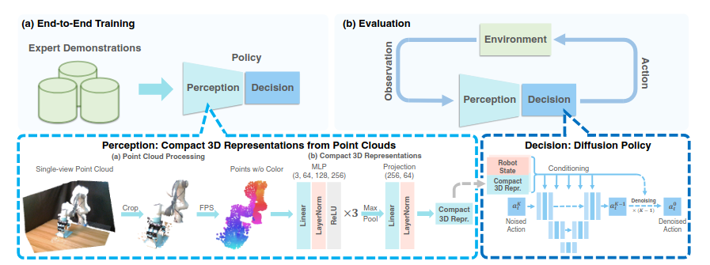

# 关于DP3的细节

**DP3网络结构图**
<div align="center">
  
</div>

## 仿真环境搭建

## 3D 点云处理部分
### 1. Crop

在文件`3D-Diffusion-Policy/diffusion_policy_3d/env_runner/adroit_runner.py`和`metaworld_runner.py`中可以通过修改`use_point_crop`这个参数来使用Crop对点云进行操作

**mjpc_diffusion_wrapper.py**

- 文件路径：`3D-Diffusion-Policy/diffusion_policy_3d/gym_util/mjpc_diffusion_wrapper.py`

- 在第 22 行中定义了 `ENV_POINT_CLOUD_CONFIG`，用来手动定义各仿真场景的点云裁剪参数。以下是该配置的具体内容：

```python
ENV_POINT_CLOUD_CONFIG = {
    'adroit_hammer': {
        'min_bound': [-10, -10, -0.099],
        'max_bound': [10, 10, 10],
        'num_points': 512,
        'point_sampling_method': 'fps',
        'cam_names': ['top'],
        'transform': ADROIT_PC_TRANSFORM,
        'scale': np.array([1, 1, 1]),
        'offset': np.array([0, 0, 1.]),
    },
    'adroit_door': {
        'min_bound': [-10, -10, -0.499],
        'max_bound': [10, 10, 10],
        'num_points': 512,
        'point_sampling_method': 'fps',
        'cam_names': ['top'],
        'transform': ADROIT_PC_TRANSFORM,
        'scale': np.array([1, 1, 1]),
        'offset': np.array([0, 0, 1.]),
    },
    'adroit_pen': {
        'min_bound': [-10, -10, -0.79],
        'max_bound': [10, 10, 10],
        'num_points': 512,
        'point_sampling_method': 'fps',
        'cam_names': ['vil_camera'],
        'transform': None,
        'scale': np.array([1, 1, 1]),
        'offset': np.array([0, 0, 0.]),
    },
}
```

***metaworld_wrapper.py***

- **文件路径**：`3D-Diffusion-Policy/diffusion_policy_3d/env/metaworld/metaworld_wrapper.py`

- 在第 16 行中定义了 `TASK_BOUNDS`，用于设置默认任务的边界参数。配置如下：

```python
TASK_BOUNDS = {
    'default': [-0.5, -1.5, -0.795, 1, -0.4, 100],
}
```

***mjpc_diffusion_wrapper.py*** 和 ***mjpc_wrapper.py*** 
- **文件路径**：`3D-Diffusion-Policy/diffusion_policy_3d/gym_util/mjpc_diffusion_wrapper.py` 和 `mjpc_wrapper。py`
- - 在第 117 行和第 125 行中定义了 `use_point_crop`，用于设置默认任务的是否裁剪点云。配置如下：
```python
def __init__(self, env, env_name:str, use_point_crop=False):
```

Available options in 'task':
	adroit_door
	adroit_hammer
	adroit_pen
	dexart_bucket
	dexart_faucet
	dexart_laptop
	dexart_toilet
	metaworld_assembly
	metaworld_basketball
	metaworld_bin-picking
	metaworld_box-close
	metaworld_button-press
	metaworld_button-press-topdown
	metaworld_button-press-topdown-wall
	metaworld_button-press-wall
	metaworld_coffee-button
	metaworld_coffee-pull
	metaworld_coffee-push
	metaworld_dial-turn
	metaworld_disassemble
	metaworld_door-close
	metaworld_door-lock
	metaworld_door-open
	metaworld_door-unlock
	metaworld_drawer-close
	metaworld_drawer-open
	metaworld_faucet-close
	metaworld_faucet-open
	metaworld_hammer
	metaworld_hand-insert
	metaworld_handle-press
	metaworld_handle-press-side
	metaworld_handle-pull
	metaworld_handle-pull-side
	metaworld_lever-pull
	metaworld_peg-insert-side
	metaworld_peg-unplug-side
	metaworld_pick-out-of-hole
	metaworld_pick-place
	metaworld_pick-place-wall
	metaworld_plate-slide
	metaworld_plate-slide-back
	metaworld_plate-slide-back-side
	metaworld_plate-slide-side
	metaworld_push
	metaworld_push-back
	metaworld_push-wall
	metaworld_reach
	metaworld_reach-wall
	metaworld_shelf-place
	metaworld_soccer
	metaworld_stick-pull
	metaworld_stick-push
	metaworld_sweep
	metaworld_sweep-into
	metaworld_window-close
	metaworld_window-open
	realdex_drill
	realdex_dumpling
	realdex_pour
	realdex_roll
